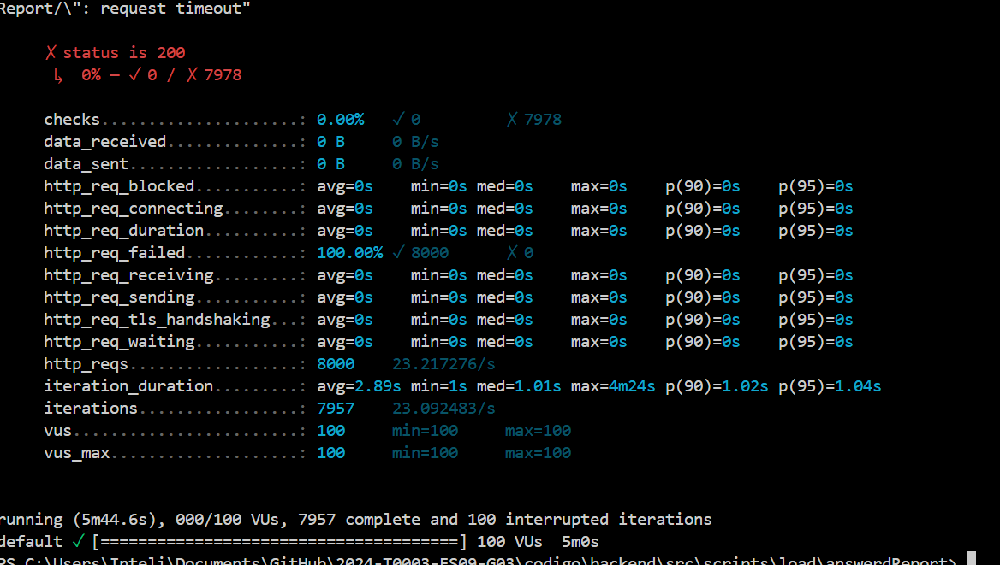

# Análise Detalhada do k6

## Visão Geral do k6

O k6, desenvolvido pela Grafana, é uma ferramenta de código aberto para testes de carga, simplificando e tornando acessíveis os testes de desempenho para equipes de engenharia. Destacando-se no cenário de ferramentas de teste de desempenho, o k6 é uma solução gratuita, centrada no desenvolvedor e altamente extensível.

Essa ferramenta possibilita a avaliação do desempenho e da confiabilidade de sistemas de forma simplificada, permitindo a detecção precoce de regressões de desempenho e outras questões. Além disso, o k6 é projetado para auxiliar no desenvolvimento de aplicações resilientes e de alto desempenho, garantindo que possam lidar não só com as demandas atuais, mas também com o crescimento futuro.

Sua abordagem simplificada na criação de scripts de teste de carga, escritos em JavaScript, facilita a integração com fluxos de trabalho de CI/CD, promovendo práticas de DevOps e agilizando o ciclo de desenvolvimento de software. Priorizando a experiência do desenvolvedor e a extensibilidade, o k6 oferece uma plataforma robusta para testar não apenas aplicações web, mas também APIs e serviços de microserviços.

## Conceitos Explorados

Durante os testes realizados utilizando o k6 na rota "answeredReport", destinada ao envio de respostas aos usuários, diversos conceitos foram explorados:

### 1. **Scripting de Teste**

A capacidade de escrever scripts em JavaScript que definem o fluxo dos testes de carga, incluindo requisições HTTP(S) para endpoints específicos, manipulação de parâmetros e headers, e tratamento das respostas.

### 2. **Usuários Virtuais (VUs)**

Compreensão do conceito de Usuários Virtuais (VUs), simulando usuários reais acessando o sistema. Isso permite ajustar a carga de trabalho variando o número de VUs e o tempo de duração dos testes para simular diferentes cenários de uso.

### 3. **Análise de Métricas**

A interpretação das métricas geradas pelos testes, fornecendo insights sobre o desempenho do sistema. Métricas como checks, data_received, data_sent, entre outras, fornecem informações cruciais sobre o comportamento do sistema sob carga.

## Resultados dos Testes

Foram realizados testes em seis cenários distintos, cada um apresentando resultados específicos. Destacamos dois desses cenários para análise detalhada:

### Cenário 1: 10 Usuários em 5 Minutos

Neste cenário, todas as verificações passaram com sucesso, indicando um desempenho satisfatório do sistema. A duração média das requisições foi de aproximadamente 11.97ms, com todas as iterações concluídas dentro do esperado. O número máximo de VUs ativos foi 10, conforme configurado para o teste.

### Cenário 2: 100 Usuários em 5 Minutos

Contrastando com o cenário anterior, este apresentou falhas significativas. Todas as verificações falharam, indicando problemas no sistema. Sugerindo possíveis erros de configuração, problemas de rede ou inoperância do endpoint testado. 

### k6 - script1

 </img>

  </img>

##  100 usuários, 5 minutos:

  </img>

## Conclusão

O uso do k6 possibilitou uma análise detalhada do desempenho do sistema, identificando áreas de melhoria e potenciais problemas. Sua abordagem simplificada e extensível o torna uma ferramenta valiosa para equipes de engenharia, facilitando a realização de testes de carga e garantindo a robustez e confiabilidade das aplicações desenvolvidas.
